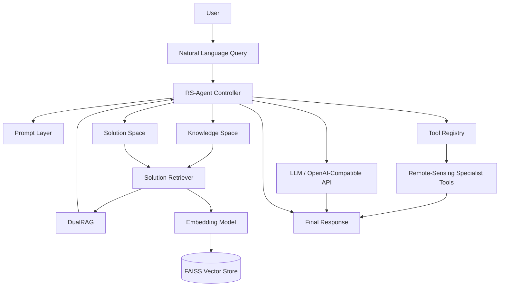

<div align="center">

# SatQuery AI

### Agentic Vision-Language Assistant for Remote Sensing

[](https://www.python.org/)
[](https://www.langchain.com/)
[](https://platform.openai.com/)
[](https://huggingface.co/)
[](https://faiss.ai/)
[](https://www.sbert.net/)

[](https://docs.pydantic.dev/)
[](https://pyyaml.org/)
[](https://ollama.com/)
[](https://pytest.org/)
[](https://docs.astral.sh/ruff/)

<br />

[](https://github.com/altafshaikh7/satquery)
[](LICENSE)
[](https://github.com/altafshaikh7/satquery)

<br />

**Agentic AI • Remote Sensing • Vision-Language Models • Retrieval-Augmented Generation**

</div>

> **SatQuery AI is a research-oriented agentic remote-sensing framework that connects natural-language queries with intelligent retrieval, reasoning, and extensible remote-sensing tools.**

SatQuery AI explores how **LLMs, agentic orchestration, retrieval-augmented reasoning, knowledge spaces, solution retrieval, and specialist tools** can be combined to automate remote-sensing workflows.

The current repository contains the **RS-Agent research layer**, including the agent controller, prompt system, knowledge and solution spaces, toolkit registry, retrieval components, DualRAG, benchmarks, examples, configurations, and tests.

---

# Overview

Traditional remote-sensing analysis often requires users to understand domain-specific terminology, choose the correct analysis workflow, locate relevant methods, and manually operate specialized tools.

SatQuery AI aims to simplify this workflow by allowing users to interact with remote-sensing systems through **natural-language queries**.

The agent can be extended with specialist tools so that different remote-sensing tasks can be connected to the same orchestration layer.

### Core Workflow

```text
User Natural-Language Query
            │
            ▼
     Agent Controller
            │
            ▼
    Query Understanding
            │
            ▼
 ┌─────────────────────────┐
 │ Knowledge / Retrieval   │
 │ Solution Space / RAG    │
 └────────────┬────────────┘
              │
              ▼
        Tool Registry
              │
              ▼
   Remote-Sensing Tools
              │
              ▼
        Task Execution
              │
              ▼
       Final Response
```

---

# Key Features

## Agentic Remote-Sensing Workflow

* Agent-based task orchestration
* Natural-language query handling
* Prompt-driven reasoning
* Configurable LLM backend
* Extensible agent architecture

## Knowledge & Solution Retrieval

* Knowledge-space architecture
* Solution-space architecture
* Solution retrieval
* Solution indexing
* Embedding-based retrieval
* FAISS vector search

## Tool-Based Architecture

SatQuery AI uses a toolkit abstraction that allows remote-sensing capabilities to be added as independent tools.

The architecture is designed to support specialist capabilities such as:

* Satellite image analysis
* Image understanding
* Vegetation analysis
* Built-up area analysis
* Change detection
* Raster/GeoTIFF processing
* Multi-sensor analysis

> These capabilities are integration targets unless their implementation is present in the current repository.

## DualRAG

The repository includes a modified **LightRAG-based DualRAG** implementation.

DualRAG introduces:

* Keyword importance scoring
* Global query retrieval
* Keyword-weighted retrieval
* Dual-path retrieval
* Knowledge-intensive reasoning support

## LLM Support

The project supports an OpenAI-compatible LLM architecture and includes integration with:

* OpenAI APIs
* LangChain
* Hugging Face
* Sentence Transformers
* Optional Ollama-based local models

---

# Architecture



---

# Technology Stack

## Core

| Technology        | Purpose                      |
| ----------------- | ---------------------------- |
| **Python 3.9+**   | Core development language    |
| **Setuptools**    | Package and build management |
| **LangChain**     | Agent and LLM orchestration  |
| **Pydantic**      | Data validation              |
| **PyYAML**        | Configuration management     |
| **python-dotenv** | Environment configuration    |

## AI & LLM

| Technology                | Purpose                             |
| ------------------------- | ----------------------------------- |
| **OpenAI SDK**            | LLM API integration                 |
| **LangChain OpenAI**      | OpenAI-compatible model integration |
| **Hugging Face Hub**      | Model and embedding access          |
| **Sentence Transformers** | Text embeddings                     |
| **Ollama**                | Optional local LLM execution        |

## Retrieval

| Technology   | Purpose                              |
| ------------ | ------------------------------------ |
| **FAISS**    | Vector similarity search             |
| **DualRAG**  | Weighted dual-path retrieval         |
| **LightRAG** | Retrieval foundation used by DualRAG |
| **NumPy**    | Numerical processing                 |

## Development & Testing

| Technology | Purpose           |
| ---------- | ----------------- |
| **pytest** | Automated testing |
| **Ruff**   | Code linting      |
| **tqdm**   | Progress tracking |

---

# Project Structure

```text
satquery/
│
├── benchmarks/
│   ├── planning/
│   └── rschatgpt/
│
├── configs/
│   └── default.yaml
│
├── data/
│   ├── indices/
│   └── solutions/
│
├── dualrag/
│   ├── DUALRAG.md
│   ├── datasets/
│   ├── lightrag/
│   └── reproduce/
│
├── examples/
│   ├── demo.py
│   └── sample.png
│
├── images/
│   ├── Agent-logo.png
│   ├── IntellSensing.png
│   ├── RS-Agent_framework.png
│   ├── method.png
│   ├── qualitative_result.png
│   └── teaser_figure.png
│
├── rs_agent/
│   ├── controller/
│   │   ├── agent.py
│   │   └── prompts.py
│   │
│   ├── knowledge_space/
│   │
│   ├── solution_space/
│   │   ├── builder.py
│   │   └── retriever.py
│   │
│   ├── toolkit/
│   │   ├── registry.py
│   │   └── stubs.py
│   │
│   └── config.py
│
├── scripts/
│   └── build_solution_index.py
│
├── tests/
│   └── test_basic.py
│
├── .env.example
├── pyproject.toml
├── requirements.txt
├── LICENSE
└── README.md
```

---

# Installation

## Prerequisites

Make sure you have:

* Python 3.9+
* pip
* Git
* An OpenAI-compatible API key for hosted LLM experiments

Optional:

* Ollama for local LLM experimentation

---

## Clone Repository

```bash
git clone https://github.com/altafshaikh7/satquery.git
cd satquery
```

---

## Create Virtual Environment

### Windows

```powershell
python -m venv .venv
.venv\Scripts\Activate.ps1
```

### Linux / macOS

```bash
python3 -m venv .venv
source .venv/bin/activate
```

---

## Install Dependencies

```bash
pip install -r requirements.txt
```

For development dependencies:

```bash
pip install -e ".[dev]"
```

---

# Environment Configuration

Create a `.env` file from `.env.example`.

```env
OPENAI_API_KEY=your-api-key
OPENAI_API_BASE=https://api.openai.com/v1

EMBEDDING_MODEL=moka-ai/m3e-base
EMBEDDING_DEVICE=cpu
```

Optional Ollama configuration:

```env
OLLAMA_BASE_URL=http://localhost:11434
```

> **Security:** Never commit API keys, credentials, or private configuration files to GitHub.

---

# Running the Project

Run the included example:

```bash
python examples/demo.py
```

---

# Solution Index

Build the solution index using:

```bash
python scripts/build_solution_index.py
```

The generated index is used by the solution retrieval layer.

---

# DualRAG

DualRAG is included inside the `dualrag/` directory.

It extends the LightRAG retrieval approach with **weighted keyword importance and dual-path retrieval**.

### Retrieval Flow

```text
User Query
     │
     ▼
Keyword Extraction
     │
     ▼
Keyword Importance Scores
     │
     ├───────────────┐
     ▼               ▼
Global Query      Weighted
Retrieval         Keyword Retrieval
     │               │
     └───────┬───────┘
             ▼
       Combined Evidence
             │
             ▼
        Agent Reasoning
```

Install DualRAG:

```bash
cd dualrag
pip install -e .
```

Detailed instructions:

```text
dualrag/DUALRAG.md
```

---

# Research Workflow

SatQuery AI follows a structured research and development workflow:

```text
Problem Identification
          ↓
Requirement Analysis
          ↓
Study Existing Systems
          ↓
Research Gap Identification
          ↓
Design Proposed System
          ↓
Prototype Development
          ↓
Testing & Evaluation
```

---

# Research Context

The project is related to research areas including:

* Agentic AI in Remote Sensing
* Vision-Language Models
* Earth Observation
* Retrieval-Augmented Generation
* Satellite Image Understanding
* Remote-Sensing Task Planning
* Bi-Temporal Change Detection
* Multi-Sensor Remote Sensing

### Related Systems

* RS-Agent
* EarthGPT
* RSUniVLM
* VRSBench
* CDVQA
* BigEarthNet

---

# Current Implementation

The current repository provides the **agent and retrieval infrastructure** for SatQuery AI.

### Implemented

* RS-Agent controller
* Prompt system
* Knowledge-space structure
* Solution-space structure
* Solution retrieval
* Toolkit registry
* DualRAG retrieval
* Embedding integration
* FAISS vector retrieval
* Configurable LLM backend
* Benchmark structure
* Example workflow
* Automated tests

### Planned Specialist Integrations

The architecture can be extended with:

* VQA
* NDVI
* NDBI
* Bi-temporal change detection
* Optical/SAR processing
* GeoTIFF/raster analysis
* Satellite image captioning
* Image grounding

These are listed as **planned/integration targets**, not as completed features of the current repository.

---

# Testing

Run the test suite:

```bash
pytest
```

For linting:

```bash
ruff check .
```

---

# Configuration

Default configuration:

```text
configs/default.yaml
```

Environment configuration:

```text
.env
```

This allows model, embedding, and runtime parameters to be changed without modifying the core source code.

---

# Roadmap

* [ ] Integrate specialist remote-sensing tools
* [ ] Add GeoTIFF/raster processing
* [ ] Integrate VQA pipeline
* [ ] Integrate NDVI analysis
* [ ] Integrate NDBI analysis
* [ ] Add bi-temporal change detection
* [ ] Add optical/SAR processing
* [ ] Improve agent execution trace
* [ ] Expand benchmark evaluation
* [ ] Add quantitative performance metrics
* [ ] Build interactive web interface
* [ ] Add production deployment workflow

---

# Project Status

**Research Prototype — Active Development**

SatQuery AI is currently being developed as a research and prototyping platform for agentic remote-sensing workflows.

The architecture is intentionally modular so that new models, retrieval strategies, and specialist remote-sensing tools can be integrated independently.

---

# Repository

<div align="center">

[](https://github.com/altafshaikh7/satquery)

</div>

---

# License

This project is licensed under the **Apache License 2.0**.

See the [LICENSE](LICENSE) file for details.

---

<div align="center">

### SatQuery AI

**Agentic Intelligence for Remote-Sensing Workflows**

Built with **Python • LangChain • OpenAI • Hugging Face • FAISS • Sentence Transformers • DualRAG**

</div>
